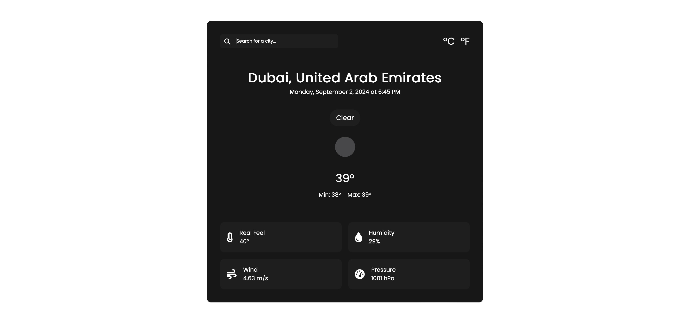

# WeatherApplication

<samp>The purpose of a weather forecasting application is to predict and communicate atmospheric conditions for a specific location and time in the future.</samp>

#
### Author
Edwin | [@edwiee](https://github.com/edwiee)

#
### 🚀 Done With
<code></code>&nbsp;&nbsp;
<code></code>&nbsp;&nbsp;
<code></code>&nbsp;&nbsp;
<code></code>

#
### Demo 👇

<samp><b><a href = "" >Click here to check weather.</a></b></samp>

#
### SnapShot

----

<samp>Made with ❤️ - <a href = "https://github.com/edwiee">edwiee</a></samp>

